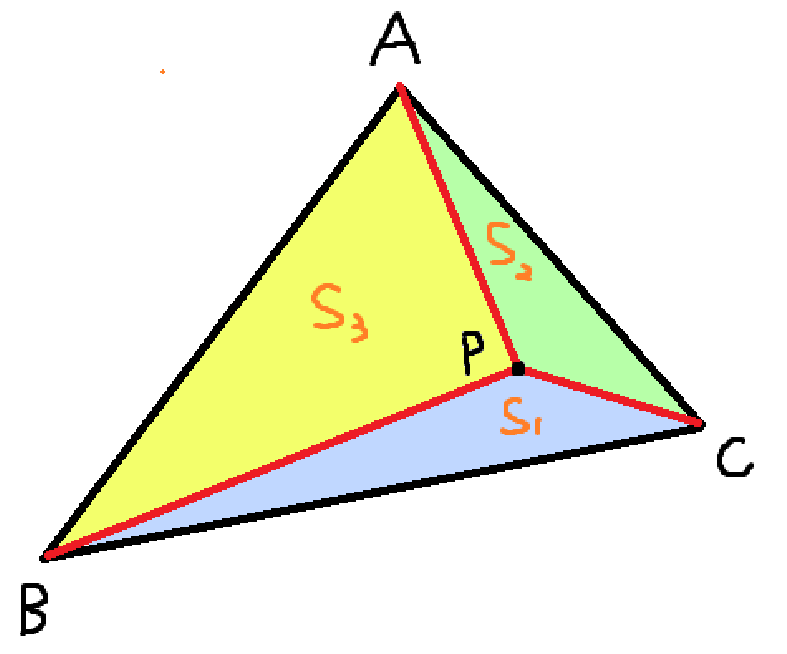

# 透视矩阵推导

[透视矩阵推导](https://www.zhyingkun.com/perspective/perspective/)

# 重心坐标公式推导



可以证明，P点的坐标可以由A，B，C三个点的加权和唯一表出：

$$
P = \alpha A + \beta B + \gamma C, \ \ \alpha + \beta + \gamma = 1, \ \ \alpha, \beta, \gamma \in [0,1]
$$

令$S$为三角形ABC的面积，$S_1$, $S_2$, $S_3$为三角形PBC，PAC，PAB的面积，下面证明：

$$
\alpha = \frac{S_1}{S}, \ \ \beta = \frac{S_2}{S}, \ \ \gamma = \frac{S_3}{S}
$$

不失一般性，只需要证明$\alpha = \frac{S_1}{S}$即可，其余两项可以通过交换三角形的三个顶点类似得出。

若以BC为底，容易得出$\alpha = \frac{h}{d}$，其中$h$为A到BC的距离，$d$为P到BC的距离。

令$\vec{n}$为直线BC的法向量，方向指向A。

则$h$即为$\vec{BA}$到$\vec{n}$上的投影长度，根据公式可得：

$$
h = |\vec{BA}| \cdot \cos\theta = |\vec{BA}| \cdot \frac{\vec{n}\cdot\vec{BA}}{|\vec{n}| \cdot |\vec{BA}|} = \vec{BA} \cdot \vec{n} = (A - B) \cdot \vec{n}
$$

类似的，$d = (P - B) \cdot \vec{n}$。

令$\alpha = 1 - \beta - \gamma$，可以得到：

$$
P = A + \beta (B - A) + \gamma (C - A)
$$

则：

$$
\begin{aligned}
P - B &= (A - B) + \beta (B - A) + \gamma (C - A) \\
&= (1 - \beta - \gamma)(A - B) + \gamma (C - B) \\
&= \alpha (A - B) + \gamma (C - B)
\end{aligned}
$$

因此有：

$$
d = (P - B) \cdot \vec{n} = \alpha (A - B) \cdot \vec{n} + \gamma (C - B) \cdot \vec{n}
$$

由于$\vec{n}$是BC的法向量，所以$(C - B) \cdot \vec{n} = 0$，因此：

$$
d = \alpha (A - B) \cdot \vec{n} = \alpha h
$$

于是：

$$
\alpha = \frac{d}{h} = \frac{S_1}{S}
$$

得证。

将两点式直线方程转化为一般式直线方程：

$$
Ax+By+C=0 \Leftrightarrow (y_1-y_0)x + (x_0-x_1)y + (x_1y_0-x_0y_1) = 0
$$

根据点到直线的距离公式可得：

$$
\begin{aligned}
\beta &= \frac{S_2}{S} = \frac{d_{P\rightarrow AC}}{d_{B\rightarrow AC}} = \frac{|(y_a - y_c)x_p+(x_c-x_a)y_p+(x_a y_c-x_c y_a)|}{|(y_a - y_c)x_b+(x_c-x_a)y_b+(x_a y_c-x_c y_a)|} \\
\gamma &= \frac{S_3}{S} = \frac{d_{P\rightarrow AB}}{d_{C\rightarrow AB}} = \frac{|(y_a - y_b)x_p+(x_b-x_a)y_p+(x_a y_b-x_b y_a)|}{|(y_a - y_b)x_c+(x_b-x_a)y_c+(x_a y_b-x_b y_a)|} \\
\alpha &= 1 - \beta - \gamma 
\end{aligned}
$$

对于三维空间中封闭图形，向某个坐标平面投影后的面积为：

$$
S' = S \cdot \cos\theta = S (\vec{k} \cdot \vec{n})
$$

其中，$\vec{k}$为垂直于投影的坐标平面的法向量（比如xy平面，其法向量就为$\vec{z}$），$\vec{n}$为封闭图形所在平面的法向量，与$\vec{k}$同向。

因此可以由重心坐标与三角形面积的关系可知，三角形在投影到xy平面之后，其小三角形和原三角形的面积之比不变，因此可以在投影到xy平面上的三角形求得重心坐标公式。

关于**重心坐标深度插值的透视矫正公式**，以及将**任意属性的重心坐标插值的透视矫正公式**可以参考[【重心坐标插值、透视矫正插值】原理以及用法见解](https://blog.csdn.net/motarookie/article/details/124284471)

# Z-Test操作与cuda线程互斥锁

[Warp与互斥锁踩坑](https://no5-aaron-wu.github.io/2021/11/30/CUDA-5-mutexLock/)

关于ZTest同时读取并写入DepthBuffer的问题，可以参考以下代码，即使用互斥锁实现，同时互斥锁的lock和unlock不能写在独立的函数中，只能够写在同一个语法块中，因为warp的运行遵循同步执行规则（locked-step execution），即一个warp中的线程同时执行一个函数，并同时退出一个函数（SIMT）：

下方代码是一个类似ZTest的功能，即在线程1-20中，前10个线程对B做ZTest，后10个线程对C做ZTest，并将两者中最大的那个写入A，如下可以正常实现互斥锁，而注释中的就不行。

```cpp
#include <cstdio>

#include "cuda.h"
#include "cuda_runtime.h"
#include "device_launch_parameters.h"
#include "vector_types.h"

#include "cooperative_groups.h"
#include "cooperative_groups/reduce.h"
namespace cg = cooperative_groups;

struct PixelLock {
    __device__ static void lock(int *mutex) {
        while(atomicCAS(mutex, 0, 1) != 0);
    }

    __device__ static void unlock(int *mutex) {
        atomicExch(mutex, 0);
    }
};

// __device__ bool ZTestAndWrite(int *A, int depth, int idx, int *mutex) {
//     PixelLock::lock(&mutex[idx]);
//     if (depth > A[idx]) {
//         atomicExch(&A[idx], depth);
//         __threadfence();
//         PixelLock::unlock(&mutex[idx]);
//         return true;
//     }
//     PixelLock::unlock(&mutex[idx]);
//     return false;
// }

__device__ bool ZTestAndWrite(int *A, int depth, int idx, int *mutex) {
    bool blocked = true;
    bool res = false;
    while (blocked) {
        if (atomicCAS(&mutex[idx], 0, 1) == 0) {
            if (depth > A[idx]) {
                atomicExch(&A[idx], depth);
                // A[idx] = depth;
                res = true;
            }
            __threadfence();
            atomicExch(&mutex[idx], 0);
            blocked = false;
        }
    }
    return res;
}

__global__ void RSMain(int *A, int *B, int *C, int *mutex) {
    int idx = blockIdx.x * blockDim.x + threadIdx.x;

    int depth;
    if (idx < 10) depth = B[idx];
    else depth = C[idx-10];
    if (idx >= 10) idx -= 10;

    if (ZTestAndWrite(A, depth, idx, mutex)) {
        printf("activate pixel %d\n", idx);
    }
}

int main()
{
    int A[] = {0, 0, 0, 0, 0, 0, 0, 0, 0, 0};
    int B[] = {6, 6, 6, 7, 7, 7, 8, 8, 8, 9};
    int C[] = {5, 10, 5, 10, 5, 10, 5, 10, 5, 10};

    int *d_A, *d_B, *d_C;
    cudaMalloc(&d_A, 10 * sizeof(int));
    cudaMalloc(&d_B, 10 * sizeof(int));
    cudaMalloc(&d_C, 10 * sizeof(int));
    cudaMemcpy(d_A, A, 10 * sizeof(int), cudaMemcpyHostToDevice);
    cudaMemcpy(d_B, B, 10 * sizeof(int), cudaMemcpyHostToDevice);
    cudaMemcpy(d_C, C, 10 * sizeof(int), cudaMemcpyHostToDevice);

    int *mutex = new int[10];
    for (int i = 0; i < 10; i ++) {
        mutex[i] = 0;
    }
    int *d_mutex;
    cudaMalloc(&d_mutex, 10 * sizeof(int));
    cudaMemcpy(d_mutex, mutex, 10 * sizeof(int), cudaMemcpyHostToDevice);
    

    // RSMain<<<20, 1>>>(d_A, d_B, d_C, d_mutex);
    RSMain<<<1, 20>>>(d_A, d_B, d_C, d_mutex);
    cudaDeviceSynchronize();

    int *r_A = new int[10];
    cudaMemcpy(r_A, d_A, 10 * sizeof(int), cudaMemcpyDeviceToHost);

    for (int i = 0; i < 10; i ++) {
        printf("%d ", r_A[i]);
    }
    printf("\n");

    cudaFree(d_A);
    cudaFree(d_B);
    cudaFree(d_C);
    delete[] r_A;
    return 0;
}
```

单单修改ZTest是不足够的，如果要写入一串整体上的数据（比如数据A，B，C，D），可能会有冲突，比如说，通过ZTest，线程1和线程2先后写入数据ABCD，而最终我需要的是线程2写入的数据，但是，如果线程2先写入AB，然后线程1写入ABCD，最后线程2写入CD，那么数据AB就是线程1写入的，而CD是线程2覆盖写入的，此时出现了问题。

因此需要在光栅化着色器中，对写入到frag片段中的所有数据，都需要统一加上一个锁（当然会有速度上的损耗）。